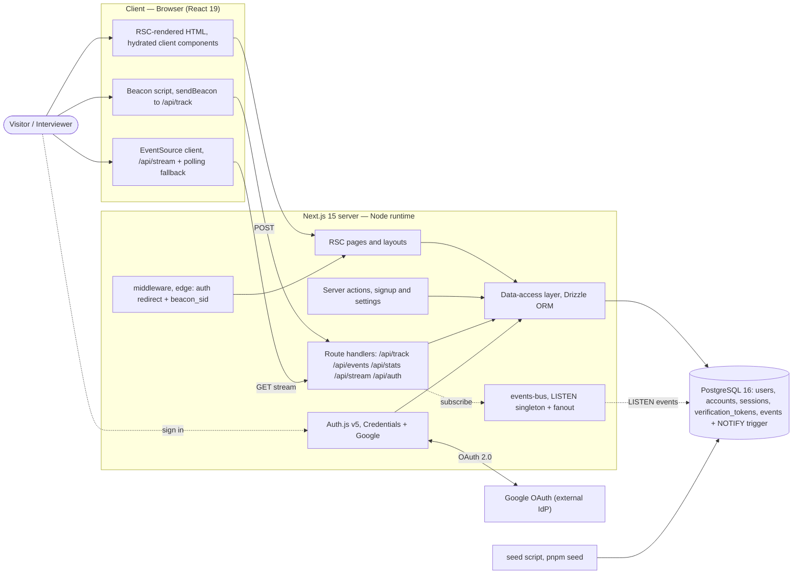
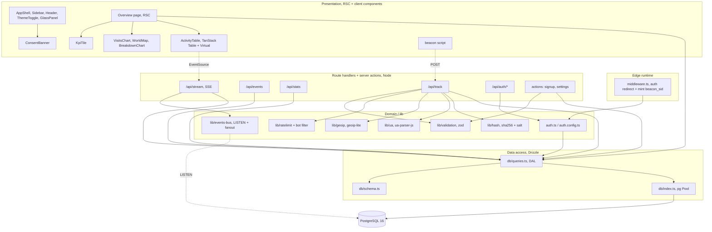
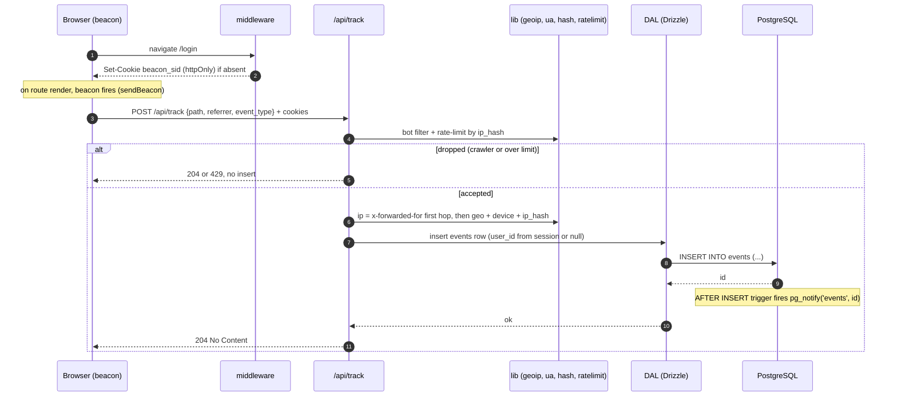
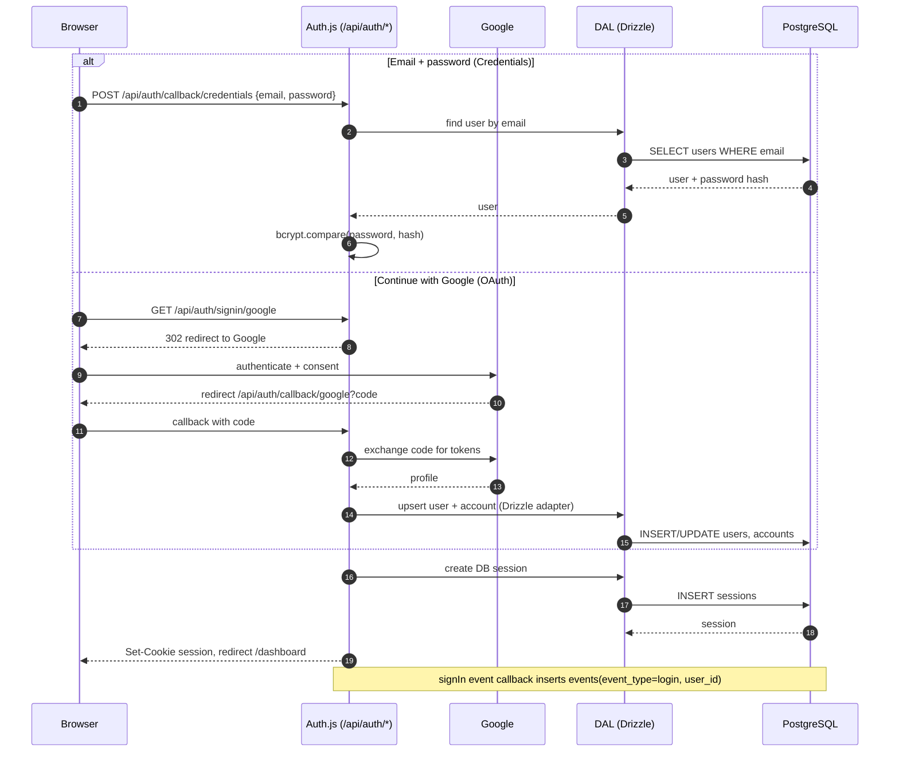
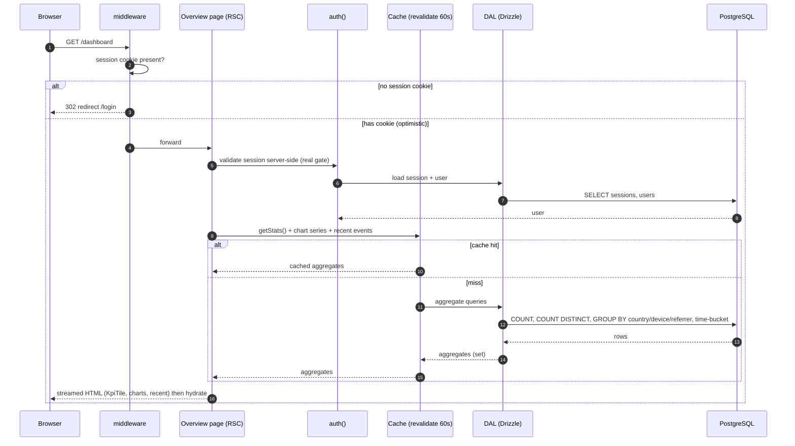
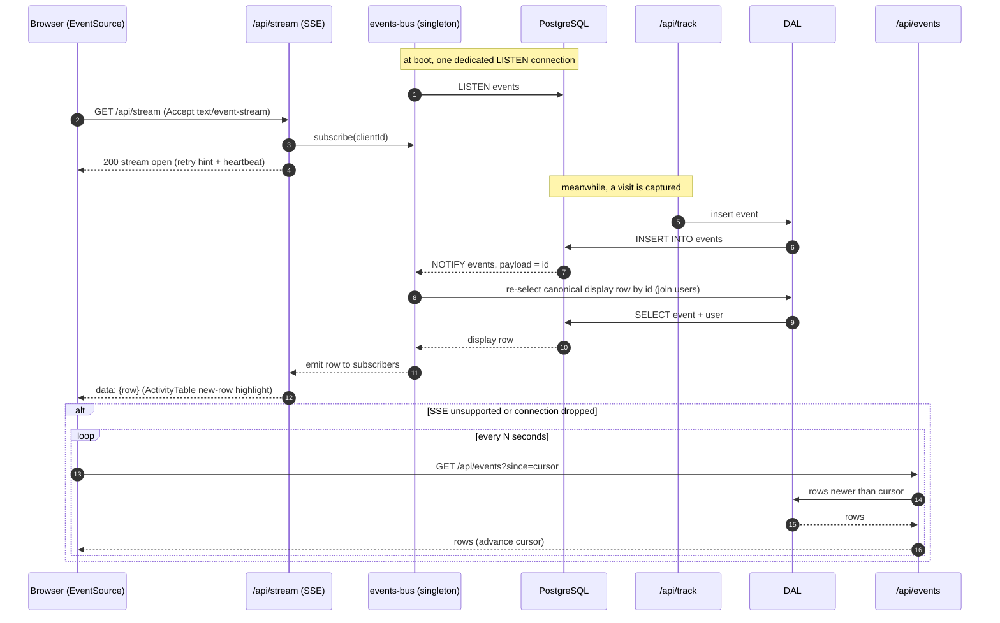

# Beacon — System Architecture

> Elaborates on `00-product-spec.md` (the source of truth). All names here —
> routes, endpoints, tables, columns, KPI keys, components — are the canonical
> ones from spec §12. Where the spec left an implementation choice open, this
> doc makes it; those decisions are flagged in **§0**.

**Status:** approved design · **Date:** 2026-07-16
**Scope:** how Beacon is built and wired. Data DDL/indexes live in the data
model doc (`02-data-model.md`); the threat model lives in `05-privacy-security.md`.

---

## 0. Decisions this doc makes (spec left open)

| # | Decision | Rationale |
|---|----------|-----------|
| D1 | **Real-time is driven by a Postgres `AFTER INSERT` trigger on `events` that calls `pg_notify`.** | One place fires for every insert path (beacon, OAuth login event, even seed). No app code to remember. |
| D2 | **`NOTIFY` payload carries only the row `id`; the Node listener re-selects the canonical display row (joined to `users`) before fan-out.** | The SSE row and the `/api/events` row share one query builder → no shape drift, and we never hit the 8 KB `NOTIFY` payload cap. Ceiling noted in §7. |
| D3 | **Single long-lived Node server (not edge/serverless) is the primary deploy target.** | SSE + `LISTEN/NOTIFY` need a persistent process and a persistent TCP Postgres connection. The polling fallback (§5) keeps a serverless deploy functional. |
| D4 | **Auth is split into an edge-safe `auth.config.ts` (used by middleware) and a full `auth.ts` (adapter + providers, Node only).** | `bcrypt`, `geoip-lite`, and the Drizzle adapter are Node-native and cannot run on the Edge runtime that middleware uses. |
| D5 | **`session_id` comes from an httpOnly `beacon_sid` cookie minted by middleware.** | Server-owned, tamper-resistant, present before the first beacon fires. Satisfies spec §5 (`session_id | cookie`). |
| D6 | **Rate-limit + KPI aggregates start in-process** (in-memory limiter, `revalidate`-cached stats). | Correct for one instance; upgrade paths in §7. |

Env var naming (§6) follows Auth.js v5 conventions (`AUTH_GOOGLE_ID` / `AUTH_GOOGLE_SECRET`) rather than the shorthand in the task brief.

---

## 1. System context

Beacon is a **real-time visitor-activity analytics dashboard that watches
itself**. There is no external site to instrument — Beacon's own public pages
(`/login`, `/signup`) are the tracked property. Every visit to those pages
becomes a row in `events`; authenticated users open `/dashboard` and watch the
full activity stream as KPI tiles, charts, a world map, and a live table.

The "watches itself" loop:

1. A visitor loads a public page → a **beacon** in the browser POSTs to `/api/track`.
2. The server derives IP / geo / device **on the server** (never trusts the client) and inserts an `events` row.
3. The insert fires `pg_notify` → the live feed pushes the new row to every open dashboard over SSE.
4. If that visitor **signs in**, a `login` event is recorded and their subsequent rows carry a `user_id` — the same session visibly "flips" from *Anonymous · city · Chrome on macOS* to *name + avatar*.

The database ships **seeded** (20 users, ~800–1,200 events over 30 days) so the
dashboard is never empty; real captured visits append on top.

### 1.1 Container diagram (C4-ish)



**Trust boundary:** everything server-side derives IP/geo/device and enforces
auth; the browser supplies only `path`, `referrer`, and `event_type` on the
beacon — all treated as untrusted input (zod-validated).

---

## 2. Component architecture (App Router layers)

Beacon is a single Next.js 15 App Router application. Responsibilities split
into six layers; data only ever flows down to Postgres through the Drizzle DAL.

- **Edge — `middleware.ts`**: runs on every page request. (a) optimistic auth
  redirect for `/dashboard/*`, (b) mints the httpOnly `beacon_sid` cookie. Edge
  runtime → no DB, no native modules; it uses the lightweight `auth.config.ts`.
- **Presentation — RSC pages + client components**: server components fetch via
  the DAL and stream HTML; only interactive leaves are client components. Canonical
  components: `AppShell`, `Sidebar`, `Header`, `ThemeToggle`, `GlassPanel`,
  `KpiTile`, `VisitsChart`, `WorldMap`, `BreakdownChart`, `ActivityTable`, `ConsentBanner`.
- **Route handlers + Server actions (Node)**: `/api/track`, `/api/events`,
  `/api/stats`, `/api/stream`, `/api/auth/*`; server actions for `signup` and
  `settings`. These are the only write entry points.
- **Domain / lib**: `geoip` (geoip-lite), `ua` (ua-parser-js), `hash`
  (sha256 + `IP_SALT`), `ratelimit` + bot filter, `validation` (zod),
  `events-bus` (LISTEN singleton + in-process fan-out), Auth.js config.
- **Data access (Drizzle)**: `db/schema.ts` (the 5 tables), `db/queries.ts`
  (the DAL — every read/write aggregate lives here), `db/index.ts` (pg `Pool`).
- **PostgreSQL 16**: tables + the `events` NOTIFY trigger.



**Runtime pinning**: `/api/track`, `/api/stream`, `/api/auth/*`, and the
signup action set `export const runtime = 'nodejs'` (geoip-lite, bcrypt, and the
LISTEN connection are Node-only). `/api/stream` and `/api/events` set
`dynamic = 'force-dynamic'` / `no-store`; `/api/stats` and dashboard segments
are cacheable (§7).

---

## 3. Request & data flows

### 3a. Anonymous visit capture (beacon → `/api/track` → derive → insert)



Key points: IP/geo/device are **server-derived** (spec §5); the client never
supplies them. `event_type` on this path is `page_view` or `click`. The insert
is the *only* thing that triggers the live feed — no separate publish call.

### 3b. Email+password login and Google OAuth



- **DB sessions** via the Drizzle adapter → the `sessions` table is the source of
  truth (`accounts` holds the Google link, `verification_tokens` is present for
  the adapter contract).
- The **`signIn` event callback** is the single place that records a `login`
  event — it fires for both providers, so there is exactly one code path.
- **Signup** is a server action: zod-validate → check email uniqueness →
  `bcrypt.hash` (cost 12) → insert `users` → record a `signup` event → then
  `signIn('credentials')`. (A fresh signup thus yields a `signup` then a
  `login` event — accurate, and no de-dup needed for this app.)

### 3c. Dashboard read (RSC → aggregates)



Middleware's redirect is **optimistic** (it only sees the cookie); the real gate
is `auth()` inside the `(dashboard)` layout, which validates the session against
the DB. KPI keys returned by `getStats()`: `total_visits`, `unique_visitors`,
`signed_in_ratio`, `live_now`, `top_country`. `live_now` (active sessions in the
last 5 min) is time-sensitive — it uses a short/no TTL while the rest cache for
~60 s (§7).

### 3d. Real-time live feed (LISTEN/NOTIFY → SSE → client, + polling fallback)



---

## 4. Repository structure (Next.js 15)

```
beacon/
├─ app/
│  ├─ layout.tsx                      # root: fonts (Geist/Geist Mono), theme, ConsentBanner, beacon
│  ├─ page.tsx                        # /  → redirect: authed → /dashboard, else → /login
│  ├─ globals.css                     # Tailwind v4 + design tokens (CSS vars)
│  ├─ (auth)/
│  │  ├─ login/page.tsx               # /login  — login/signup surface
│  │  └─ signup/page.tsx              # /signup — same surface, signup mode
│  ├─ (dashboard)/
│  │  ├─ layout.tsx                   # AppShell + auth() gate (Sidebar, Header)
│  │  ├─ dashboard/page.tsx           # Overview: tiles + charts + map + recent
│  │  ├─ dashboard/activity/page.tsx  # ActivityTable (filters, search, pagination)
│  │  ├─ dashboard/users/page.tsx     # 20 users: signups, last seen, counts
│  │  ├─ dashboard/map/page.tsx       # full-screen WorldMap
│  │  └─ dashboard/settings/page.tsx  # theme, privacy (IP handling), account
│  ├─ actions/
│  │  ├─ signup.ts                    # server action: zod → bcrypt → insert → signIn
│  │  └─ settings.ts                  # theme / IP-handling preference
│  └─ api/
│     ├─ auth/[...nextauth]/route.ts  # /api/auth/*  (Auth.js handlers)
│     ├─ track/route.ts               # POST ingest (beacon)
│     ├─ events/route.ts              # GET list (paginated, filterable, ?since=)
│     ├─ stats/route.ts               # GET KPI aggregates
│     └─ stream/route.ts              # GET SSE live feed
├─ components/
│  ├─ shell/                          # AppShell, Sidebar, Header, ThemeToggle
│  ├─ ui/                             # GlassPanel + primitives
│  ├─ kpi/KpiTile.tsx
│  ├─ charts/                         # VisitsChart, WorldMap, BreakdownChart
│  ├─ activity/ActivityTable.tsx
│  └─ ConsentBanner.tsx
├─ lib/
│  ├─ geoip.ts                        # geoip-lite wrapper
│  ├─ ua.ts                           # ua-parser-js wrapper
│  ├─ hash.ts                         # sha256(ip + IP_SALT)
│  ├─ ratelimit.ts                    # per-ip_hash limiter + bot filter
│  ├─ validation.ts                   # zod schemas (track, signup, filters)
│  ├─ events-bus.ts                   # LISTEN singleton + EventEmitter fan-out
│  ├─ auth.ts                         # Auth.js v5: providers + Drizzle adapter (Node)
│  └─ auth.config.ts                  # edge-safe subset for middleware
├─ db/
│  ├─ schema.ts                       # users, accounts, sessions, verification_tokens, events
│  ├─ index.ts                        # drizzle(pg Pool)
│  └─ queries.ts                      # DAL: aggregates, list, inserts, canonical row select
├─ drizzle/
│  ├─ 0000_init.sql                   # generated migrations
│  ├─ 0001_events_notify.sql          # notify_event() fn + AFTER INSERT trigger
│  └─ meta/                           # drizzle-kit journal + snapshots
├─ scripts/
│  └─ seed/
│     ├─ index.ts                     # pnpm seed  (idempotent; --reset wipes)
│     ├─ users.ts                     # 20 demo users
│     └─ events.ts                    # ~800–1,200 events, 30 days, ~12–15 countries
├─ middleware.ts                      # matcher: pages + /dashboard/*; excludes _next/static
├─ drizzle.config.ts
├─ next.config.ts
├─ .env.example
└─ package.json                       # scripts: dev, build, start, db:push, db:generate, db:migrate, seed
```

`db/queries.ts` is the DAL boundary: pages, route handlers, actions, seed, and
the events-bus all read/write through it — nothing else touches Drizzle
directly, so the canonical row projection (used by both `/api/events` and the
SSE re-query) has exactly one definition.

---

## 5. Real-time design

**Pipeline:** `INSERT events` → DB trigger `pg_notify('events', id)` → the one
`events-bus` LISTEN connection receives it → bus re-selects the canonical
display row → fans out to every subscribed `/api/stream` handler → each writes
an SSE `data:` frame → `ActivityTable` prepends the row with a highlight.

**Why a trigger (D1/D2):** every insert path is covered without app-level
publish calls, and shipping only the `id` keeps the trigger dumb, dodges the
8 KB `NOTIFY` limit, and reuses the DAL's canonical projection so the streamed
row is byte-identical to a polled one.

**One listener, in-process fan-out:** exactly one Postgres connection per
instance holds `LISTEN events`; SSE clients subscribe to an in-process
`EventEmitter`, not to their own DB connection. This is what keeps N concurrent
dashboards from opening N Postgres connections. Because `NOTIFY` broadcasts to
*every* listening backend across *all* instances, this pattern is already
multi-instance-correct: each instance runs its own listener and every instance's
SSE clients get the row — **no message broker needed**.

**Connection lifecycle:**
- *Open:* `GET /api/stream` returns `text/event-stream` with
  `Cache-Control: no-store`, `Connection: keep-alive`,
  `X-Accel-Buffering: no` (defeats proxy buffering). Sends an initial `retry:`
  hint and registers the subscriber.
- *Keep-alive:* a `: heartbeat` comment every ~15 s holds the connection open
  through idle proxies and detects dead sockets.
- *Close:* the handler listens for request `abort` (tab close / navigation) and
  unsubscribes from the bus, preventing leaks. On server shutdown the bus
  releases the LISTEN connection.
- *Reconnect:* `EventSource` auto-reconnects using the `retry:` interval;
  server-set `id:` + client `Last-Event-ID` (or the `since` cursor) closes the
  gap on reconnect.

**Fallback (spec §8):** if `EventSource` is unavailable or errors past a retry
budget, the client polls `GET /api/events?since=<cursor>` every N seconds,
advancing the cursor by the newest `created_at`/`id`. Same DAL, same row shape —
the fallback reuses the existing list endpoint, no parallel code.

**Why not WebSockets:** the live feed is strictly one-way (server → client); the
only client → server traffic is the beacon POST, which is a plain request.
`EventSource` gives auto-reconnect and `Last-Event-ID` for free over ordinary
HTTP with cookie auth on a GET — no upgrade handshake, no second server, no
subprotocol. WebSockets would add bidirectional machinery we would never use and
fit the deploy model (§6) worse. SSE is the smaller correct tool.

---

## 6. Configuration & environments

### Required environment variables (`.env.example`)

| Var | Purpose |
|-----|---------|
| `DATABASE_URL` | Postgres 16 connection string (TCP — see the driver note). |
| `AUTH_SECRET` | Auth.js session/token signing secret. |
| `AUTH_URL` | Canonical app URL (used behind proxies / for OAuth callbacks). |
| `AUTH_TRUST_HOST` | `true` on non-Vercel hosts so Auth.js trusts the deploy origin. |
| `AUTH_GOOGLE_ID` | Google OAuth client ID (the "GOOGLE_ID" of the brief). |
| `AUTH_GOOGLE_SECRET` | Google OAuth client secret. |
| `IP_SALT` | Salt for `ip_hash = sha256(ip + IP_SALT)`. |
| `IP_STORAGE` | `raw` \| `hash` — default IP handling (spec §11); `hash` = privacy-max. |
| `RATE_LIMIT_PER_MIN` | Per-`ip_hash` cap on `/api/track` (tuning knob). |
| `PORT` / `NODE_ENV` | Standard runtime config. |

**Driver note:** the app uses **node-postgres (`pg`)** — a `Pool` for
requests plus **one dedicated session connection** for `LISTEN`. HTTP-only
serverless drivers (e.g. Neon HTTP) cannot hold `LISTEN/NOTIFY`; if fronting the
app `Pool` with **PgBouncer**, it must run in *session* mode for the listener
(transaction-mode pooling silently breaks `LISTEN`), or the listener connects
direct while only the request pool goes through the bouncer.

### Local dev

- `docker compose up` → Postgres 16; `.env.local` with a local `DATABASE_URL`.
- `pnpm install && pnpm db:push && pnpm seed && pnpm dev` (spec §13 success path).
  `db:push` (drizzle-kit) is fine locally; `db:push` also applies the notify
  trigger migration.
- Google OAuth optional locally (Credentials alone works); set the callback to
  `http://localhost:3000/api/auth/callback/google` if enabled.

### Deploy-ready

- **Single Node container** + managed Postgres 16 (Fly.io / Railway / Render /
  VPS) — a long-lived process is required for SSE + LISTEN (D3).
- Migrations via `pnpm db:migrate` (`drizzle-kit migrate`), **not** `db:push`.
- Real `AUTH_SECRET`, `AUTH_URL`, `AUTH_TRUST_HOST=true`, HTTPS, secure cookies.
- **Vercel caveat:** serverless functions freeze/time-limit long responses and
  can't hold `LISTEN`. If deployed there, `/api/stream` degrades and the
  **polling fallback** (§5) carries the live feed; put the streaming server on a
  Node host instead for the full experience.

---

## 7. Non-functional notes

**Performance.** Reads are indexed aggregates over a ~30-day window (~1k seed
rows). The authoritative index set lives in `02-data-model.md`; architecturally
the hot paths need indexes on `events(created_at desc)`, `events(user_id)`,
`events(session_id)`, `events(country_code)`, and `events(event_type)` — plus
the PK for the SSE re-query (D2). Aggregates are plain `COUNT` /
`COUNT(DISTINCT)` / `GROUP BY` — cheap at this scale.

**Caching.**
- Dashboard RSC segments + `/api/stats`: `revalidate ≈ 60s` (or `unstable_cache`
  with a tag) — freshness comes from the SSE feed, not from re-fetching stats,
  so 60 s-stale KPIs are fine. `live_now` uses a short/zero TTL.
- `/api/events` and `/api/stream`: `no-store`, dynamic.
- The `AppShell`/`Sidebar` shell is largely static; only data leaves re-render.

**Scalability ceilings (and where they break):**
- **SSE fan-out** is in-process → memory-bound per instance (~low thousands of
  concurrent streams). Scale horizontally: each instance LISTENs independently,
  so it just works — no broker. `// ponytail: in-process EventEmitter fan-out; add Redis pub/sub only if a single instance can't hold the connection count`.
- **Postgres connections**: request `Pool` + 1 listener/instance. Ceiling is
  `max_connections`; front the pool with PgBouncer (session mode for the
  listener, per §6).
- **Rate limiter** is per-instance in-memory → effective cap is `N × limit`
  across N instances. `// ponytail: in-memory limiter; move to Upstash/Redis when multi-instance`.
- **NOTIFY re-query** is one PK `SELECT` per event. Fine here; at high write
  throughput switch to a fat `NOTIFY` payload or batch. `// ponytail: per-event re-select; fat payload if insert rate outgrows it`.
- **Aggregates** are recomputed per request (cached). At millions of events,
  add a daily rollup table / materialized view refreshed on a schedule.

**Observability hooks.** Structured logs (e.g. pino) at ingest with
`{ request_id, event_type, ip_hash, geo_hit, dropped_reason, latency_ms }`;
counters for track `accepted` vs `dropped(bot|ratelimit)`; a gauge of connected
SSE subscribers from the bus; DB query timing in the DAL. A lightweight health
check (DB `SELECT 1` + listener-alive) supports readiness probes. Error tracking
(Sentry) is an optional drop-in. All are hook points, not a platform — kept
minimal per the non-goals.
