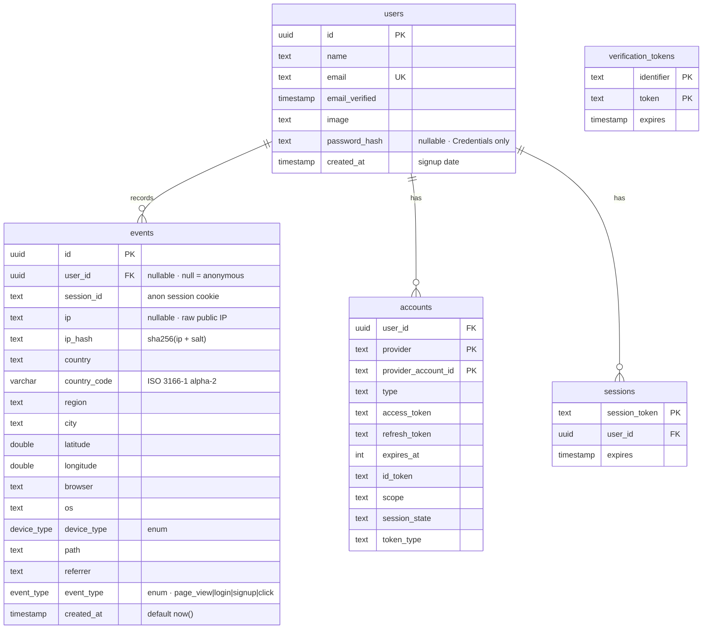

# Beacon — Data Model

> Elaborates on `00-product-spec.md`. Canonical names from spec §12 are law here:
> tables are exactly `users`, `accounts`, `sessions`, `verification_tokens`
> (Auth.js) and `events` (activity). `events` columns match spec §5 verbatim.
> Nothing in this doc renames anything. Privacy policy defaults are owned by
> `05-privacy-security.md`; this doc only wires the columns and jobs that enforce them.

**Status:** approved data model · **Date:** 2026-07-16
**Stack:** PostgreSQL 16 · Drizzle ORM · `@auth/drizzle-adapter` (Auth.js v5)

---

## 1. ERD

Five tables. `users` 1—* `events` (the activity stream). `users` 1—* `accounts`
and `users` 1—* `sessions` are the Auth.js identity links. `verification_tokens`
stands alone (no FK — keyed by `(identifier, token)`).



> Cardinality note: `events.user_id` is nullable, so an event participates in
> `users` as zero-or-one. The `||--o{` crow's-foot reads "a user records
> zero-or-many events"; anonymous events simply carry `user_id = NULL`.

---

## 2. Drizzle schema

One file, `src/db/schema.ts`. Adapter tables keep the JS property keys that
`@auth/drizzle-adapter` reads (`emailVerified`, `sessionToken`,
`providerAccountId`, `refresh_token`, …) — those keys are load-bearing, the
adapter looks them up by name. SQL column/table names are snake_case for a
uniform database; the adapter maps by JS key, not by SQL name, so this is safe.
UUID primary keys are used throughout: `crypto.randomUUID()` (what the adapter
generates) is a valid `uuid` literal, so a `uuid` column accepts adapter-written ids.

```ts
import {
  pgTable, pgEnum, uuid, text, varchar, timestamp,
  integer, doublePrecision, primaryKey, index, uniqueIndex,
} from 'drizzle-orm/pg-core';
import { relations, sql } from 'drizzle-orm';
import type { AdapterAccountType } from 'next-auth/adapters';

/* ── enums ─────────────────────────────────────────────────────────── */
export const eventType = pgEnum('event_type', [
  'page_view', 'login', 'signup', 'click',   // spec §12
]);
export const deviceType = pgEnum('device_type', [
  'desktop', 'mobile', 'tablet', 'other',    // ua-parser-js device.type (undefined ⇒ desktop)
]);

/* ── Auth.js adapter tables (spec §12 names) ───────────────────────── */
export const users = pgTable('users', {
  id: uuid('id').primaryKey().defaultRandom(),
  name: text('name'),
  email: text('email').notNull(),
  emailVerified: timestamp('email_verified', { mode: 'date' }),
  image: text('image'),
  // Credentials provider (spec §4) — bcrypt cost 12. Null for OAuth-only users.
  passwordHash: text('password_hash'),
  createdAt: timestamp('created_at', { withTimezone: true }).notNull().defaultNow(),
}, (t) => [
  uniqueIndex('users_email_uq').on(t.email),   // adapter looks up users by email
]);

export const accounts = pgTable('accounts', {
  userId: uuid('user_id').notNull().references(() => users.id, { onDelete: 'cascade' }),
  type: text('type').$type<AdapterAccountType>().notNull(),
  provider: text('provider').notNull(),
  providerAccountId: text('provider_account_id').notNull(),
  refresh_token: text('refresh_token'),
  access_token: text('access_token'),
  expires_at: integer('expires_at'),
  token_type: text('token_type'),
  scope: text('scope'),
  id_token: text('id_token'),
  session_state: text('session_state'),
}, (t) => [
  primaryKey({ columns: [t.provider, t.providerAccountId] }),
]);

export const sessions = pgTable('sessions', {
  sessionToken: text('session_token').primaryKey(),
  userId: uuid('user_id').notNull().references(() => users.id, { onDelete: 'cascade' }),
  expires: timestamp('expires', { mode: 'date' }).notNull(),
});

export const verificationTokens = pgTable('verification_tokens', {
  identifier: text('identifier').notNull(),
  token: text('token').notNull(),
  expires: timestamp('expires', { mode: 'date' }).notNull(),
}, (t) => [
  primaryKey({ columns: [t.identifier, t.token] }),
]);

/* ── events (activity) — columns are spec §5 verbatim ──────────────── */
export const events = pgTable('events', {
  id: uuid('id').primaryKey().defaultRandom(),
  sessionId: text('session_id').notNull(),                 // cookie · anon correlation
  userId: uuid('user_id').references(() => users.id, { onDelete: 'set null' }), // null = anon
  ip: text('ip'),                                          // nullable · dropped in hash-only mode
  ipHash: text('ip_hash').notNull(),                       // sha256(ip + salt) · always present
  country: text('country'),
  countryCode: varchar('country_code', { length: 2 }),     // ISO 3166-1 alpha-2 · map + top_country
  region: text('region'),
  city: text('city'),
  latitude: doublePrecision('latitude'),
  longitude: doublePrecision('longitude'),
  browser: text('browser'),
  os: text('os'),
  deviceType: deviceType('device_type'),
  path: text('path').notNull(),
  referrer: text('referrer'),
  eventType: eventType('event_type').notNull().default('page_view'),
  createdAt: timestamp('created_at', { withTimezone: true }).notNull().defaultNow(),
}, (t) => [
  index('events_created_at_idx').on(t.createdAt),          // §3.1
  index('events_country_code_idx').on(t.countryCode),      // §3.2
  index('events_user_id_idx').on(t.userId),                // §3.3
  index('events_session_id_idx').on(t.sessionId),          // §3.4
  index('events_type_created_idx').on(t.eventType, t.createdAt), // §3.5
  index('events_ip_hash_idx').on(t.ipHash),                // §3.6
]);

/* ── relations (Drizzle query API) ─────────────────────────────────── */
export const usersRelations = relations(users, ({ many }) => ({
  events: many(events),
  accounts: many(accounts),
  sessions: many(sessions),
}));
export const eventsRelations = relations(events, ({ one }) => ({
  user: one(users, { fields: [events.userId], references: [users.id] }),
}));
```

> **Auth strategy note (spec §4):** Auth.js Credentials logins require the JWT
> session strategy (a known adapter constraint — Credentials can't persist to
> `sessions`). Google/OAuth logins use the `sessions` table via the Drizzle
> adapter. The table exists per §12 and is populated for OAuth; Credentials
> sessions live in the signed JWT. Both paths still write `events` on login.

---

## 3. Indexes

`events` is append-heavy and read by time window, geography, identity, and
session. Six indexes, one per real query shape. PK/unique indexes on the adapter
tables come from their `primaryKey`/`uniqueIndex` declarations above and need no
extra tuning at this scale.

| # | Index | Backs |
|---|-------|-------|
| 3.1 | `events_created_at_idx (created_at)` | Every time-windowed read: visits-over-time buckets, `live_now` (`created_at > now() - 5m`), `ORDER BY created_at DESC` feed. Postgres scans the btree backward for DESC, so a plain index serves both directions. |
| 3.2 | `events_country_code_idx (country_code)` | World-map per-country `GROUP BY country_code` and `top_country`. |
| 3.3 | `events_user_id_idx (user_id)` | Identity joins, `signed_in_ratio` (`user_id IS NOT NULL`), and the Users page's per-user event counts / last-seen. |
| 3.4 | `events_session_id_idx (session_id)` | Session correlation (flip anon→identified), `live_now` (`COUNT(DISTINCT session_id)`), and unique-session rollups. |
| 3.5 | `events_type_created_idx (event_type, created_at)` | Composite for the activity table's `event_type` filter combined with time ordering, and typed time-series (login/signup counts over time). |
| 3.6 | `events_ip_hash_idx (ip_hash)` | `unique_visitors` (`COUNT(DISTINCT ip_hash)`) and per-IP abuse/rate checks on `/api/track` (spec §11). |

**Unique-visitor strategy.** Two notions, deliberately distinct:

- **`unique_visitors` KPI = `COUNT(DISTINCT ip_hash)`** over the window
  (index 3.6). Cookie-independent — survives incognito and cleared cookies, and
  `ip_hash` is always present (never null), so the count is stable. This is the
  headline number.
- **Unique *sessions* = `COUNT(DISTINCT session_id)`** (index 3.4) is the finer
  cookie-scoped grain, used for `live_now` and the signed-in ratio.

`ip_hash` is chosen over raw `ip` for uniqueness so the metric keeps working in
hash-only privacy mode (§6), where `ip` is null.

> **Scale ceiling (ponytail):** at ~1k seeded rows every query is a seq-scan
> anyway; these indexes matter at 10⁵–10⁶ rows. When `events` outgrows RAM,
> swap `events_created_at_idx` for a **BRIN** index on `created_at` — append-only
> time-correlated data is BRIN's ideal case (tiny index, cheap range scans).
> Upgrade path is a one-line migration; no query changes.

---

## 4. Aggregation queries

All served by `/api/stats` (KPIs) and the chart route handlers. `$since` is a
bound timestamp (today = `date_trunc('day', now())`, else the range toggle).

### KPI tiles (spec §9)

```sql
-- total_visits (page views; today/all-time via $since)
SELECT count(*) AS total_visits
FROM events
WHERE event_type = 'page_view' AND created_at >= $since;

-- unique_visitors
SELECT count(DISTINCT ip_hash) AS unique_visitors
FROM events
WHERE created_at >= $since;

-- signed_in_ratio (signed-in sessions ÷ all sessions)
SELECT
  count(DISTINCT session_id) FILTER (WHERE user_id IS NOT NULL)::numeric
  / NULLIF(count(DISTINCT session_id), 0) AS signed_in_ratio
FROM events
WHERE created_at >= $since;

-- live_now (active sessions in the last 5 minutes)
SELECT count(DISTINCT session_id) AS live_now
FROM events
WHERE created_at >= now() - interval '5 minutes';

-- top_country
SELECT country, country_code, count(*) AS visits
FROM events
WHERE created_at >= $since AND country_code IS NOT NULL
GROUP BY country, country_code
ORDER BY visits DESC
LIMIT 1;
```

### Chart 1 — visits over time (24h / 7d / 30d)

`$bucket` is `'hour'` for 24h, `'day'` for 7d/30d. Gap-filled with
`generate_series` so empty buckets render as zero (no broken line):

```sql
SELECT g.bucket, coalesce(e.visits, 0) AS visits
FROM generate_series(
       date_trunc($bucket, $since),
       date_trunc($bucket, now()),
       ('1 ' || $bucket)::interval
     ) AS g(bucket)
LEFT JOIN (
  SELECT date_trunc($bucket, created_at) AS bucket, count(*) AS visits
  FROM events
  WHERE created_at >= $since AND event_type = 'page_view'
  GROUP BY 1
) e USING (bucket)
ORDER BY g.bucket;
```

### Chart 2 — world map (per-country counts)

```sql
SELECT country_code, country,
       count(*)                 AS visits,
       count(DISTINCT ip_hash)  AS uniques
FROM events
WHERE created_at >= $since AND country_code IS NOT NULL
GROUP BY country_code, country
ORDER BY visits DESC;
```

### Chart 3 — device & referrer breakdown

```sql
-- device donut
SELECT coalesce(device_type::text, 'other') AS device, count(*) AS n
FROM events
WHERE created_at >= $since
GROUP BY device
ORDER BY n DESC;

-- top referrers bars (empty/null referrer ⇒ 'direct')
SELECT coalesce(nullif(referrer, ''), 'direct') AS referrer, count(*) AS n
FROM events
WHERE created_at >= $since
GROUP BY referrer
ORDER BY n DESC
LIMIT 8;
```

---

## 5. Seed spec

Script: `scripts/seed.ts`, run by `pnpm seed`. Target: **20 users** +
**random 800–1200 events** over the **last 30 days** (spec §6). Deterministic —
a fixed-seed PRNG (e.g. `mulberry32(0xBEAC0N)`) makes every run produce the same
dataset, which is what lets it be idempotent.

**Users.** Fixed array of 20 realistic names, emails on the **`@beacon.demo`**
domain (this is the "seeded" marker — see idempotency), avatar URLs, and
`created_at` (signup) spread across the 30-day window (a few older). Insert via
`onConflictDoUpdate({ target: users.email })` — re-running refreshes, never
duplicates.

**Events.** For each of N events:

1. **Timestamp** — sample a day weighted by day-of-week (weekday ×1.0, weekend
   ×0.6), then an hour weighted by a diurnal curve (trough 00:00–06:00, peak
   09:00–18:00). Produces a believable rhythm for Chart 1.
2. **Geo** — pick a country from a weighted pool of **14 countries** and write
   `country`, `country_code`, `region`, `city`, `latitude`, `longitude`
   **directly** (seed does not call geoip-lite — direct writes keep it
   deterministic and offline). Suggested weights:

   | code | country | weight | code | country | weight |
   |------|---------|--------|------|---------|--------|
   | US | United States | 22 | NL | Netherlands | 5 |
   | GB | United Kingdom | 12 | BR | Brazil | 5 |
   | DE | Germany | 10 | AU | Australia | 4 |
   | IN | India | 9 | JP | Japan | 4 |
   | CA | Canada | 7 | SG | Singapore | 3 |
   | FR | France | 6 | ES | Spain | 3 |
   | | | | SE | Sweden | 3 |

3. **Device / browser / OS** — device: desktop 60% / mobile 33% / tablet 7%;
   browser: Chrome 63% / Safari 19% / Firefox 8% / Edge 8% / other 2%; OS derived
   from the device+browser pick.
4. **Referrer** — direct 45% / Google 30% / LinkedIn 10% / GitHub 8% / X 7%
   (spec §6 sources).
5. **event_type** — `page_view` 85% / `click` 10% / `login` 3% / `signup` 2%.
6. **Identity** — with probability ~0.4, attribute to a random user **whose
   signup ≤ this timestamp** → set `user_id` and reuse that user's stable
   `session_id` (`seed_u_<userId>`); otherwise anonymous with
   `session_id = seed_a_<n>`. Yields a ~35–45% signed-in ratio.
7. **IP** — synthesize a plausible IP from the country's range, store
   `ip_hash = sha256(ip + SEED_SALT)`; leave `ip` populated (seed mimics
   raw-store mode).

Bulk-insert in chunks of ~500 with `onConflictDoNothing()`.

**Idempotency.** Event ids are deterministic — `uuidv5(SEED_NS, String(n))` — so
a second `pnpm seed` inserts the same ids and `onConflictDoNothing` makes it a
true no-op. Real captured events (real session ids, real user emails) are never
touched. This satisfies "seed never wipes real data" (spec §6).

**`--reset`.** Deletes **only seeded rows**, then regenerates:

```sql
DELETE FROM events WHERE session_id LIKE 'seed\_%';
DELETE FROM users  WHERE email LIKE '%@beacon.demo';  -- cascades accounts/sessions
```

Real visits and real users survive `--reset`. (A `--reset --all` flag could
`TRUNCATE events`; out of scope until asked.)

---

## 6. Retention & privacy hooks

Policy defaults and the threat model are owned by **`05-privacy-security.md`**;
this section is only the schema/columns/jobs that enforce whatever that doc sets.

**Raw `ip` vs `ip_hash`.** `ip_hash` (`NOT NULL`) is always written and powers
every metric that needs uniqueness, so analytics never depend on retaining raw
IPs. Raw `ip` is **nullable** and governed by the Settings → privacy toggle
(spec §11): in **hash-only mode** ingest writes `ip = NULL`; in **raw mode** it
stores the IP for a short window then a scrub job nulls it. Default is documented
in `05-privacy-security.md`.

**Retention window.** Scheduled jobs (cron / pg_cron), not app code:

```sql
-- IP minimisation: scrub raw IPs older than the raw-retention window
UPDATE events SET ip = NULL
WHERE ip IS NOT NULL AND created_at < now() - interval '7 days';

-- Event retention: drop events past the retention window
DELETE FROM events WHERE created_at < now() - interval '180 days';
```

(7 / 180 days are placeholders — authoritative values live in
`05-privacy-security.md`.) `ip_hash` and aggregate rows survive scrubbing, so
dashboards are unaffected.

**User delete (erasure).**

- `events.user_id` → **`ON DELETE SET NULL`**. Deleting a user detaches their
  identity but **retains the activity** as anonymous — aggregate history stays
  intact while the PII link is severed (GDPR-friendly).
- `accounts.user_id` and `sessions.user_id` → **`ON DELETE CASCADE`** (Auth.js
  default) — OAuth links and live sessions are removed with the user.

So deleting a user cascades their `accounts`/`sessions` and nullifies their
`events.user_id`, leaving a clean anonymized trail.

---

## 7. Migration strategy

Drizzle offers two paths; Beacon uses both, by environment.

**Dev — `drizzle-kit push` (`pnpm db:push`).** Diffs the schema straight into
the local database, no migration files. Fast iteration and it's exactly what the
spec §13 success path runs (`pnpm db:push && pnpm seed && pnpm dev`). Enum and
column changes apply immediately.

**Prod / CI — `drizzle-kit generate` + `migrate`.** `generate` emits versioned,
reviewable SQL under `drizzle/`; `migrate` applies it in order. This is the only
path to production — migrations are committed, code-reviewed, and reversible;
**never `push` to prod** (an unreviewed diff can drop columns). Enum additions
(`ALTER TYPE ... ADD VALUE`) land as generated migrations.

`drizzle.config.ts` points at `DATABASE_URL` (env, per spec §11 secrets policy)
and `schema: './src/db/schema.ts'`. Seeding is separate from migrations —
`pnpm seed` runs after the schema exists and only touches data.

| | Dev | Prod / CI |
|---|---|---|
| Command | `db:push` | `generate` → `migrate` |
| Migration files | none | committed, reviewed |
| Speed | instant | ordered, auditable |
| Risk | may drop columns | safe, reversible |
